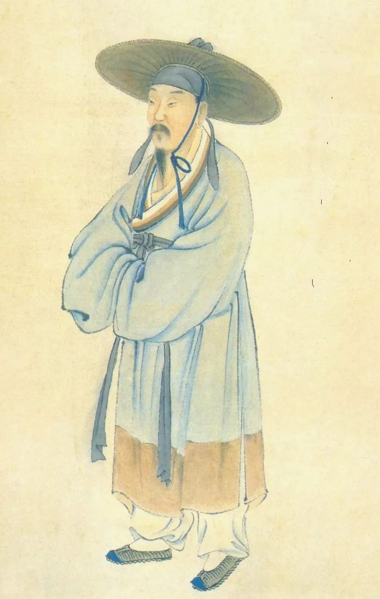
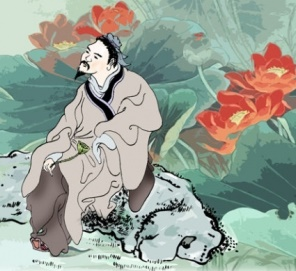
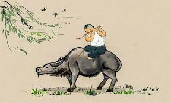

# 关卡一：诗人雅集 - 详细设计文档

## 1. 游戏概述
这是一个基于网页的古诗启蒙游戏第一关。玩家将在一幅水墨画卷中与三位著名诗人互动，通过点击诗人来了解他们的生平和代表作。

## 2. 页面布局设计

### 2.1 基础布局
```html:index.html
<!DOCTYPE html>
<html lang="zh-CN">
<head>
    <meta charset="UTF-8">
    <meta name="viewport" content="width=device-width, initial-scale=1.0">
    <title>诗人雅集</title>
    <link rel="stylesheet" href="styles.css">
</head>
<body>
    <div class="game-container">
        <!-- 水墨画背景 -->
        <div class="scroll-bg">
            <!-- 三位诗人的场景区域 -->
            <div class="scene" id="fan-scene">
                <div class="poet-area">
                    
                    <div class="scene-elements">
                        <div class="rice-field"></div>
                        <div class="farm-tools"></div>
                    </div>
                </div>
            </div>

            <div class="scene" id="yang-scene">
                <div class="poet-area">
                    
                    <div class="scene-elements">
                        <div class="plum-tree"></div>
                        <div class="ice-crystal"></div>
                    </div>
                </div>
            </div>

            <div class="scene" id="lei-scene">
                <div class="poet-area">
                    
                    <div class="scene-elements">
                        <div class="ox"></div>
                        <div class="flute"></div>
                    </div>
                </div>
            </div>
        </div>

        <!-- 对话框 -->
        <div class="dialog-box" id="dialog">
            <div class="dialog-content"></div>
            <div class="dialog-next">点击继续...</div>
        </div>

        <!-- 诗句展示 -->
        <div class="poem-display" id="poem">
            <div class="poem-text"></div>
            <div class="poem-pinyin"></div>
        </div>

        <!-- 音频元素 -->
        <audio id="bgm" loop></audio>
        <audio id="voice"></audio>
    </div>
    <script src="script.js"></script>
</body>
</html>
```

### 2.2 样式设计
```css:styles.css
/* 基础样式 */
.game-container {
    width: 100vw;
    height: 100vh;
    overflow: hidden;
    position: relative;
    background: #f5f5f5;
}

/* 水墨画卷背景 */
.scroll-bg {
    width: 100%;
    height: 100%;
    background: linear-gradient(to right, #e6e6e6, #ffffff, #e6e6e6);
    position: relative;
    display: flex;
    justify-content: space-around;
    align-items: center;
}

/* 场景样式 */
.scene {
    width: 30%;
    height: 80%;
    position: relative;
    border: 1px solid #ddd;
    border-radius: 10px;
    overflow: hidden;
    transition: transform 0.3s;
}

.scene:hover {
    transform: scale(1.05);
}

/* 诗人区域 */
.poet-area {
    width: 100%;
    height: 100%;
    position: relative;
    cursor: pointer;
}

.poet-image {
    width: 200px;
    height: auto;
    position: absolute;
    bottom: 20%;
    left: 50%;
    transform: translateX(-50%);
    transition: transform 0.3s;
}

/* 对话框样式 */
.dialog-box {
    position: absolute;
    bottom: 20px;
    left: 50%;
    transform: translateX(-50%);
    width: 80%;
    background: rgba(255, 255, 255, 0.9);
    border-radius: 10px;
    padding: 20px;
    display: none;
}

/* 诗句展示样式 */
.poem-display {
    position: absolute;
    top: 20px;
    left: 50%;
    transform: translateX(-50%);
    width: 60%;
    background: rgba(255, 255, 255, 0.9);
    border-radius: 10px;
    padding: 20px;
    display: none;
}
```

### 2.3 交互逻辑
```javascript:script.js
// 诗人数据
const POETS_DATA = {
    fan: {
        name: "范成大",
        intro: "南宋著名诗人，擅长田园诗。",
        poems: [
            {
                title: "四时田园杂兴",
                content: "昼出耘田夜绩麻，村庄儿女各当家。",
                pinyin: "zhòu chū yún tián yè jì má, cūn zhuāng ér nǚ gè dāng jiā."
            }
        ],
        audioIntro: "audio/fan-intro.mp3",
        audioPoem: "audio/fan-poem.mp3"
    },
    yang: {
        name: "杨万里",
        intro: "南宋诗人，诗风清新自然。",
        poems: [
            {
                title: "晓出净慈寺送林子方",
                content: "毕竟西湖六月中，风光不与四时同。",
                pinyin: "bì jìng xī hú liù yuè zhōng, fēng guāng bù yǔ sì shí tóng."
            }
        ],
        audioIntro: "audio/yang-intro.mp3",
        audioPoem: "audio/yang-poem.mp3"
    },
    lei: {
        name: "雷震",
        intro: "唐代诗人，善写田园生活。",
        poems: [
            {
                title: "村居",
                content: "草长莺飞二月天，拂堤杨柳醉春烟。",
                pinyin: "cǎo zhǎng yīng fēi èr yuè tiān, fú dī yáng liǔ zuì chūn yān."
            }
        ],
        audioIntro: "audio/lei-intro.mp3",
        audioPoem: "audio/lei-poem.mp3"
    }
};

// 初始化
document.addEventListener('DOMContentLoaded', () => {
    initPoets();
    initAudio();
});

// 初始化诗人交互
function initPoets() {
    const poets = document.querySelectorAll('.poet-image');
    poets.forEach(poet => {
        poet.addEventListener('click', (e) => {
            const poetId = e.target.id;
            showPoetInteraction(poetId);
        });
    });
}

// 显示诗人交互
function showPoetInteraction(poetId) {
    const poet = POETS_DATA[poetId];
    const dialog = document.getElementById('dialog');
    const dialogContent = dialog.querySelector('.dialog-content');
    
    // 显示对话框
    dialog.style.display = 'block';
    dialogContent.textContent = poet.intro;
    
    // 播放介绍音频
    const voice = document.getElementById('voice');
    voice.src = poet.audioIntro;
    voice.play();
    
    // 音频播放完成后显示诗句
    voice.onended = () => {
        showPoem(poetId);
    };
}

// 显示诗句
function showPoem(poetId) {
    const poem = POETS_DATA[poetId].poems[0];
    const poemDisplay = document.getElementById('poem');
    const poemText = poemDisplay.querySelector('.poem-text');
    const poemPinyin = poemDisplay.querySelector('.poem-pinyin');
    
    poemDisplay.style.display = 'block';
    poemText.textContent = poem.content;
    poemPinyin.textContent = poem.pinyin;
    
    // 播放诗句朗读
    const voice = document.getElementById('voice');
    voice.src = POETS_DATA[poetId].audioPoem;
    voice.play();
}

// 初始化背景音乐
function initAudio() {
    const bgm = document.getElementById('bgm');
    bgm.src = 'audio/background.mp3';
    bgm.volume = 0.3;
    bgm.play();
}
```

## 3. 实现要点

### 3.1 视觉效果
- 使用CSS渐变和混合模式实现水墨画效果
- 场景元素使用CSS动画实现动态效果
- 响应式设计确保在不同设备上的适配

### 3.2 音频处理
- 背景音乐循环播放
- 诗人介绍和诗句朗读音频队列管理
- 音频淡入淡出效果

### 3.3 交互设计
- 点击诗人触发动画和音频
- 对话框文字逐字显示效果
- 诗句朗读时文字同步高亮

### 3.4 性能优化
- 图片资源预加载
- 音频资源按需加载
- CSS动画使用transform和opacity属性

## 4. 资源清单

### 4.1 图片资源
- 水墨画背景图
- 三位诗人立绘
- 场景元素素材（稻田、梅树、牛等）

### 4.2 音频资源
- 背景音乐
- 诗人介绍语音（3段）
- 诗句朗读音频（3段）

### 4.3 字体资源
- 楷体
- 宋体
- 拼音字体

## 5. 注意事项
1. 确保所有资源文件正确加载
2. 音频播放需要用户交互触发
3. 移动端touch事件适配
4. 浏览器兼容性处理
5. 加载状态提示

## 6. 后续优化方向
1. 添加更多诗人互动动画
2. 增加场景切换效果
3. 实现进度保存功能
4. 添加音量控制
5. 优化移动端体验 