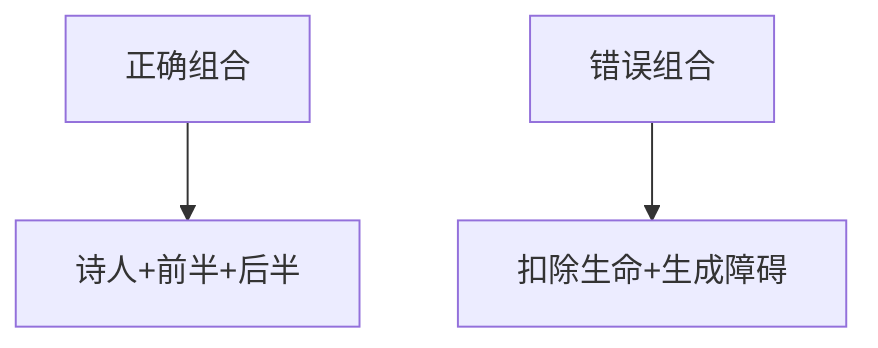
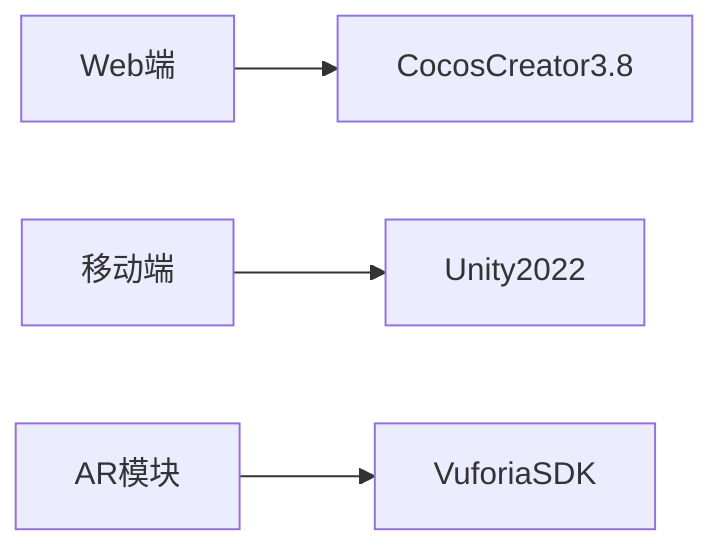

# 古诗启蒙游戏设计方案

## 核心关卡设计

### 🎮 关卡一：诗人雅集
**交互场景**：三维水墨画卷  
**角色布局**：
- 范成大（稻田/农具）
- 杨万里（梅树/冰晶）
- 雷震（牛背/横笛）

**交互流程**：
1. 点击诗人触发问候动画
2. 播放诗人自述语音
3. 自动吟诵代表作（带标准朗读）

---

### 🎮 关卡二：诗牌寻踪（卡牌消除）
**核心机制**：
```javascript
// 技术实现
const CARD_STATES = { BACK: 0, FRONT: 1, MATCHED: 2 };
const shuffleCards = (arr) => { /* Fisher-Yates算法 */ };
```

**特色设计**：
- 🃏 卡牌类型：
  - 诗句对牌（24组）
  - 诗人卡（匹配解锁视频）
  - 关键词卡（触发动画）
- ⚠️ 错误处理：3次错误触发诗人提示

---

### 🎮 关卡三：诗海淘金（羊了个羊变体）
**堆叠结构**：
| 层级 | 内容 | 概率 |
|-------|-------|-----|
| 基础层 | 诗人头像 | 40% |
| 中间层 | 诗句前半 | 30% |
| 顶层 | 诗句后半+干扰项 | 30% |

**消除逻辑**：


---

## 特色系统设计

### 🧩 复合交互系统
| 关卡 | 模式 | 核心技术 |
|-------|-------|---------|
| 关卡四 | 滑动选择/手写识别 | OCR+触摸轨迹分析 |
| 关卡五 | 动态诗轮射击 | 状态同步+碰撞检测 |
| 关卡七 | AR增强 | Vuforia图像识别 |

### 📚 知识点图谱设计
```json
// 数据架构示例
{
  "范成大": {
    "代表作": ["四时田园杂兴"],
    "关联诗人": ["杨万里", "陆游"],
    "知识节点": ["南宋田园诗", "农耕文化"]
  }
}
```

## 🛠️ 技术实施方案

### 核心框架


### 关键算法
1. 诗句混淆算法：保证干扰项语义合理性
2. 水墨渲染优化：基于SDF的笔画生成
3. 动态难度平衡：基于玩家正确率的参数调整

```
